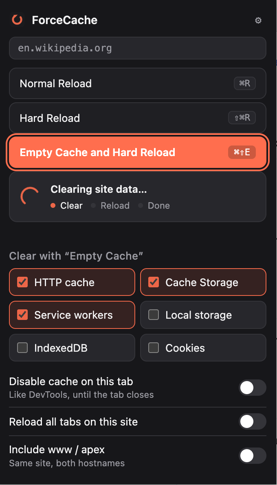

# ForceCache

**Empty Cache and Hard Reload, one click, no DevTools.**
Scoped to the current site only, so clearing it never logs you out of
anything else — your CMS admin, your email, your other tabs.

<p align="center">
  
  
</p>

Built for developers who live in Sitecore, Episerver, WordPress, or any
stack where the browser cache lies to you about whether your change
actually shipped.

## Why

Chrome's own "Empty Cache and Hard Reload" is buried behind a
right-click on the reload button, which only shows up once DevTools is
open. That's three steps and a context switch every time you want to
confirm a deploy. ForceCache puts it one click away, with more control
than Chrome's version gives you.

## Features

- **One-click menu** — Normal Reload, Hard Reload, or Empty Cache and
  Hard Reload, same mental model as Chrome's own reload button.
- **Live progress** — the popup shows exactly what's happening
  (clearing → reloading → done), not just a frozen button.
- **Pick what gets cleared** — HTTP cache, Cache Storage, service
  workers, localStorage, IndexedDB, or cookies. Always scoped to the
  current site, never the whole browser.
- **Disable cache on a tab** — same idea as the DevTools checkbox,
  automatically turned off when the tab closes.
- **Reload every open tab on a site** at once, optionally including
  `www` and apex hostname variants.
- **Protected sites list** — require a confirmation before clearing,
  so you don't accidentally nuke production.
- **Keyboard shortcuts** — `⌘⇧E` / `Ctrl+Shift+E` for empty cache +
  hard reload, `⌘⇧U` / `Ctrl+Shift+U` for a plain hard reload.
- **On-page toast + activity log**, light/dark theme, zero build step.

## Install

**From source (works today):**
1. Clone or download this repo
2. Open `chrome://extensions`
3. Enable **Developer mode** (top right)
4. Click **Load unpacked** → select the `ForceCache` folder

**Chrome Web Store:** coming soon — this repo will be updated with a
link once it's live.

**Other Chromium browsers** (Edge, Brave, Arc, Opera, Vivaldi): the
same unpacked folder works via each browser's own
`chrome://extensions`-equivalent page. Store listings for these are
planned post-Chrome-launch.

**Firefox:** not yet supported. Firefox's `browsingData` API can't
scope clearing to a single origin the way Chrome's can, so this needs
a real port rather than a repackage. Tracked as a future improvement —
contributions welcome.

## Permissions, and why

| Permission | Used for |
|---|---|
| `browsingData` | Clearing cache/storage/cookies, scoped to the origin you trigger it on |
| `activeTab` / `<all_urls>` | Knowing the current tab's origin and reloading it |
| `scripting` | Injecting the small on-page confirmation toast |
| `declarativeNetRequest` | The "disable cache on this tab" toggle |
| `contextMenus` | The right-click page/icon menu |
| `storage` | Saving your settings and activity log, locally only |

See [`.github/PRIVACY.md`](.github/PRIVACY.md) — no data ever leaves
your browser.

## Structure

No build step, no dependencies.

```
manifest.json      Manifest V3 config
background.js      Service worker — clearing, reload, badges, menus
lib/core.js         Shared settings/helpers (ES module)
popup.html/css/js   Toolbar dropdown
options.html/css/js Settings page
styles.css          Shared design tokens (light/dark)
```

## Contributing

Issues and PRs welcome — this is a free tool built to be genuinely
useful, not a product. If you want to take on the Firefox port, open
an issue first so we can talk through the origin-scoping problem.

## License

[MIT](LICENSE)
